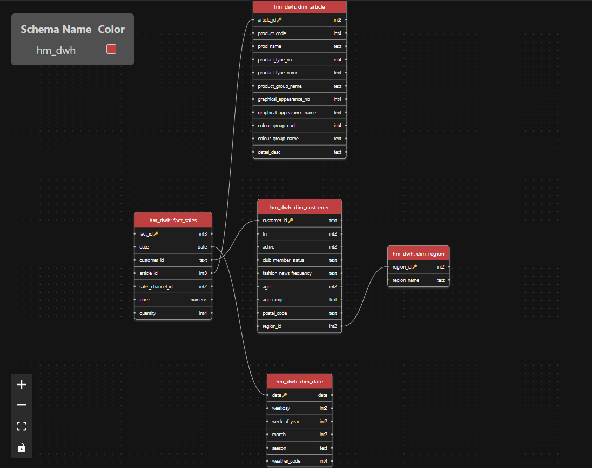

# Exercise 1 — DWH Star Schema (H&M 2019)

## Input data

The dataset consists of:

- **transactions.csv**  
  `(t_dat, customer_id, article_id, price, sales_channel_id)` — purchase line items

- **customers.csv**  
  `(customer_id, FN, Active, club_member_status, fashion_news_frequency, age, postal_code)` — customer attributes including a hex postal code

- **articles.csv**  
  — master data and product taxonomy attributes (product type, group, graphical appearance, color, etc.)

- **open-meteo-2019.csv**  
  `(day, weather_code)` — daily historic weather codes (WMO code) for 2019

**Goal:** Design a relational DWH schema that supports analysis by:
- **Time:** day, weekday, week, month, season  
- **Region:** derived from postal_code  
- **Product taxonomy:** type, group, appearance, color  
- **Customer segments:** age range, active status, club member status  
- **Weather:** on the purchase date  

---

## Fact table grain

- **Fact table:** `hm_dwh.fact_sales`  
- **Grain:** one purchased article (one line item) by one customer on one date in one sales channel  
- **Measures:** `price` and a derived `quantity = 1` to support unit-based aggregations  

---

## Target star schema tables

### `hm_dwh.dim_date`
- **PK:** `date`  
- **Attributes:** `weekday`, `week_of_year`, `month`, `season`, `weather_code`

### `hm_dwh.dim_region`
- **PK:** `region_id` (0–9)  
- **Attributes:** `region_name`

### `hm_dwh.dim_customer`
- **PK:** `customer_id`  
- **FK:** `region_id → dim_region(region_id)`  
- **Attributes:** `FN`, `Active`, `club_member_status`, `fashion_news_frequency`, `age`, `postal_code`, derived `age_range`

### `hm_dwh.dim_article`
- **PK:** `article_id`  
- **Attributes (required):**
  - `product_type_no`, `product_type_name`
  - `product_group_name`
  - `graphical_appearance_no`, `graphical_appearance_name`
  - `colour_group_code`, `colour_group_name`
- **Optional descriptive fields:** `product_code`, `prod_name`, `detail_desc` (and further taxonomy fields if desired)

### `hm_dwh.fact_sales`
- **PK:** `fact_id` (surrogate key)  
- **FKs:**
  - `date → dim_date(date)`
  - `customer_id → dim_customer(customer_id)`
  - `article_id → dim_article(article_id)`
- **Degenerate attribute:** `sales_channel_id`  
- **Measures:** `price`, `quantity`

---

## Modeling decisions

### Star schema vs. snowflake/outriggers
A **star schema** was chosen to reduce join complexity and keep SQL queries straightforward. Although product taxonomy attributes (product type/group/appearance/color) could be normalized into outrigger dimensions (snowflake design), they are kept denormalized in `dim_article` because:

- the transaction table is very large (many millions of rows), so simpler joins are beneficial  
- the assignment’s required analytics can be answered directly with one join to `dim_article`  
- ETL complexity is reduced  

### Customer flags vs. junk dimension
Low-cardinality customer attributes (`Active`, `club_member_status`, `fashion_news_frequency`) are stored directly in `dim_customer` rather than being separated into a junk dimension. These fields are naturally customer properties and do not create redundancy because each customer appears once in the dimension.

### Sales channel
`sales_channel_id` is kept in the fact table as a **degenerate dimension attribute**. The dataset provides only the ID without additional descriptive metadata, and channel analysis can still be done via grouping on the ID.

### Weather integration
Weather is stored at daily granularity in `dim_date.weather_code` by joining `open-meteo-2019.csv` on the calendar date. The raw WMO weather code is preserved to avoid losing information and to allow later grouping if needed.

---

## Assumptions

### Season definition
Seasons are derived from month:

- Winter = Dec–Feb
- Spring = Mar–May
- Summer = Jun–Aug
- Autumn = Sep–Nov

### Age ranges
`age_range` is derived from `age` using:

- `0–17`, `18–24`, `25–34`, `35–44`, `45–54`, `55–64`, `65+`, `UNKNOWN` (if age is missing)

### Region derivation from postal code
`postal_code` is interpreted as a hex string. The customer’s `region_id` is computed as:

- `region_id = (hex_to_int(postal_code) mod 10)`

The remainder is mapped to the Swedish regions given in the assignment. If `postal_code` is missing or invalid, `region_id` is set to `NULL` (or optionally an `UNKNOWN` region could be introduced).

### Weather codes
Weather codes are stored as provided (WMO code). No additional aggregation (e.g., grouping into “rainy/snowy/clear”) is applied in the schema design stage.

### Example successful run output (validation):

