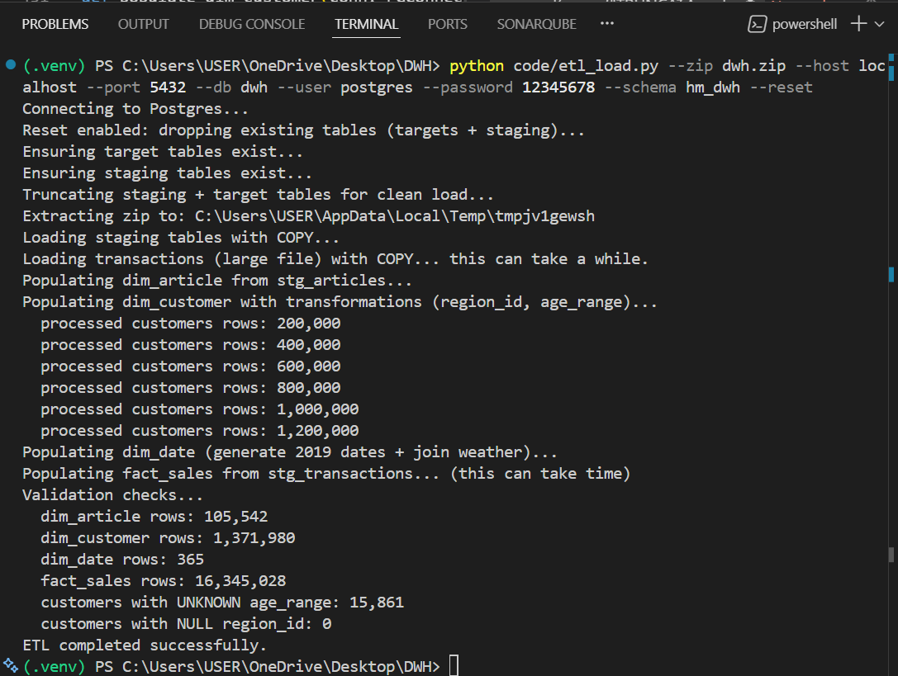

# Exercise 2 — ETL Pipeline (PostgreSQL DWH)

## Goal
Load the CSV files from `dwh.zip` into the relational DWH star schema in PostgreSQL (`hm_dwh` schema), including required enrichments:
- customer region from hex `postal_code` modulo 10
- customer age ranges (bucketing)
- time dimension with weekday/week/month/season
- daily weather enrichment from `open-meteo-2019.csv`

---

## Files delivered
- `code/etl_load.py` — complete ETL pipeline script (extract → stage → transform → load → validate)
- `sql/01_schema.sql` — schema creation script (Exercise 1)  
  *(Note: the ETL script also ensures tables exist, so schema.sql is optional when running ETL.)*

---

## Prerequisites
- Python 3.10+ (tested locally)
- PostgreSQL database (Docker or local)
- Python dependencies:

pip install -r requirements.txt

## How to run the pipeline

### Run (full reload)
This drops/recreates staging and target tables and reloads everything:

python code/etl_load.py --zip dwh.zip --host localhost --port 5432 --db dwh --user postgres --password 12345678 --schema hm_dwh --reset

### Run (rerun without dropping tables)
If tables already exist:

python code/etl_load.py --zip dwh.zip --host localhost --port 5432 --db dwh --user postgres --password 12345678 --schema hm_dwh

## Pipeline steps (high level)

1) **Extract**
- Unzips `dwh.zip` into a temporary directory.

2) **Create/ensure schema & tables**
- Ensures the star schema exists (`dim_region`, `dim_date`, `dim_customer`, `dim_article`, `fact_sales`).  
- Creates staging tables (`stg_*`) to load raw CSV data.

3) **Truncate for clean reload**
- Truncates staging + target tables in an FK-safe way.

4) **Load staging (fast COPY)**
Uses PostgreSQL `COPY` to load:
- `articles.csv` → `stg_articles`
- `customers.csv` → `stg_customers`
- `transactions.csv` → `stg_transactions`
- `open-meteo-2019.csv` → `stg_weather`

5) **Transform + Load dimensions**
- `dim_article`: inserted from `stg_articles`
- `dim_customer`: streamed from `stg_customers`, then transformed:
  - `region_id = int(postal_code, 16) % 10`
  - `age_range` derived from age bins (see assumptions)
  - integer cleaning for float-like values (e.g., `1.0`)
- `dim_date`: generated for all days in 2019 (`generate_series`) and enriched via left join to weather

6) **Load fact**
- `fact_sales` inserted from `stg_transactions`
- Joins to dimensions are used to prevent FK insert issues.

7) **Validation**
- Prints row counts for all loaded tables and key derived-field sanity checks.

---

## Data quality handling

### Float-like values in `customers.csv`
Some numeric fields in `customers.csv` appear as float-like strings (e.g., `1.0`).
- `stg_customers` stores `fn`, `active`, `age` as `DOUBLE PRECISION`.
- During dimension load, these values are cleaned using `safe_int()` to convert `1.0 → 1` and handle NULL/NaN safely.

### Invalid / missing postal codes
- If `postal_code` is NULL/empty/invalid hex, the pipeline sets `region_id = NULL`.
- In the final run shown below, `customers with NULL region_id: 0`.

### Missing / invalid ages
- If age is NULL/NaN/out of range, `age_range = 'UNKNOWN'`.

### Weather data gaps
- Weather is left-joined by day. Missing weather results in `weather_code = NULL` for that day.

---

## Assumptions used (as required in Exercise 1)

### Season mapping
- Winter = Dec–Feb
- Spring = Mar–May
- Summer = Jun–Aug
- Autumn = Sep–Nov

### Age bins
- 0–17
- 18–24
- 25–34
- 35–44
- 45–54
- 55–64
- 65+
- UNKNOWN (missing/invalid age)

### Example successful run output (validation):

